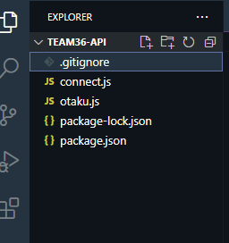
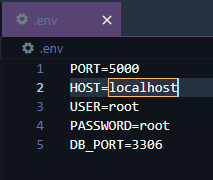
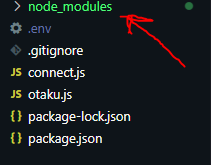
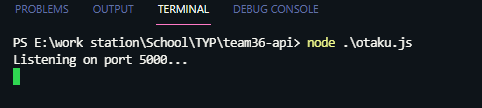

# _team36-api_

###  _````config start````_
### step 1 (cloning repo)
- clone the _team36-api_ repo by typing in `git clone https://github.com/IFMTYP/team36-api.git`, then go into the cloned repo using the `cd team36-api` command.
- the repo should look like:
> 

### step 2 (setting up .env)
- create a `.env` file then configure it accordingly
    *  PORT=`the port number that you want the API to listen to.`
    *  HOST=`the host of the database.`
    *  USER=`the DBMS user.`
    *  PASSWORD=`the DBMS password.`
    *  DB_PORT=`the port that the database is listening.`
>e.g 
### step 3 (installing modules)
- install the modules needed for the API to work, by running `npm i` and click return btn
>eg 
- this will create a new folder called "node_modules" consisting of all the dependencies found in the package.json file.
>eg 
### Finally
run the program by typing `node otaku.js` OR if you have nodemon installed type `nodemon otaku.js` and click return btn.
>eg 
###  _````config end````_
