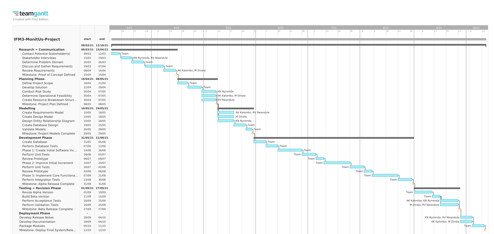
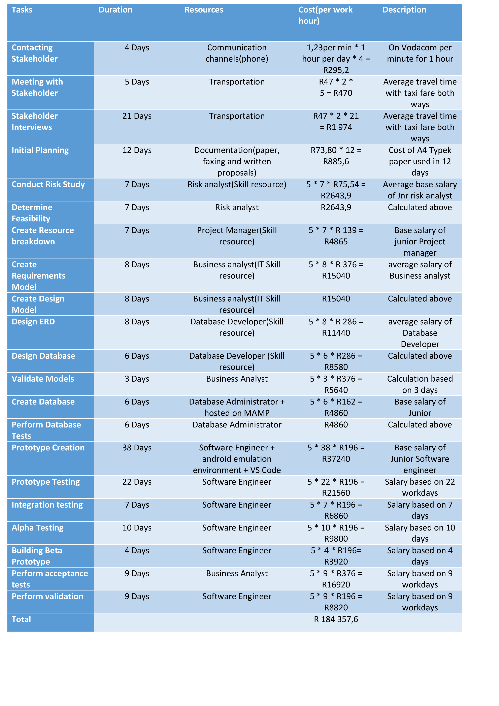

# Gantt Chart

# Cost Estimation of Project

The total cost of the project considers the duration of the task, the resources involved in fulfiling the task, and the average salary of position performing the task.

* Estimating that we work for 5 hours per day, we calculate the cost of skill dependent tasks as:

        cost = 5 * duration * industry salary per hour

### Below is a table estimating the costs for performing each task and the total project cost

## References

https://www.news24.com/fin24/companies/ict/here-is-what-you-are-paying-for-cellphone-calls-and-data-20190422-2

https://za.indeed.com/career/junior-risk-analyst/salaries

https://za.indeed.com/career/junior-database-administrator/salaries

https://za.indeed.com/career/junior-project-manager/salaries

https://za.indeed.com/career/business-analyst/salaries

https://za.indeed.com/career/database-developer/salaries

https://za.indeed.com/career/junior-software-engineer/salaries

