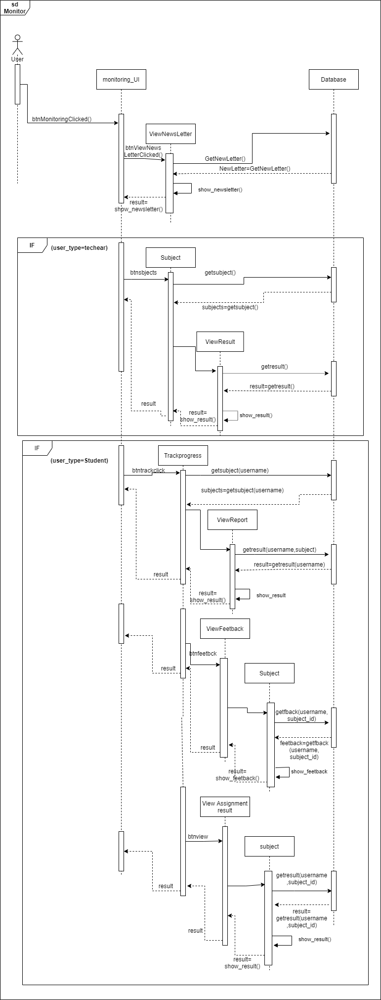
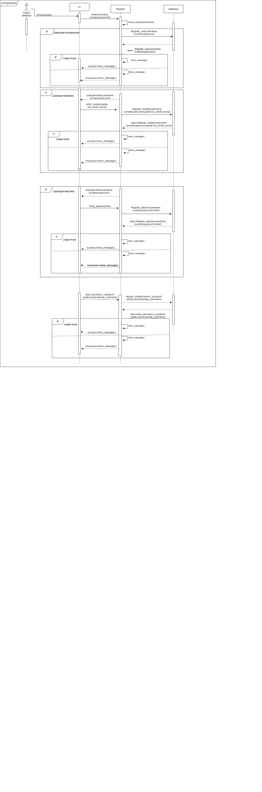
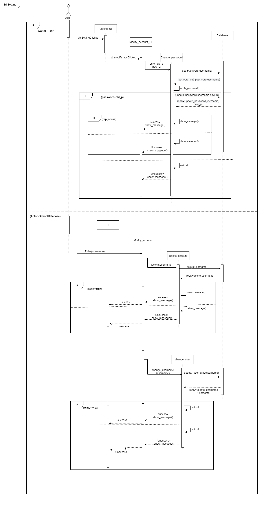
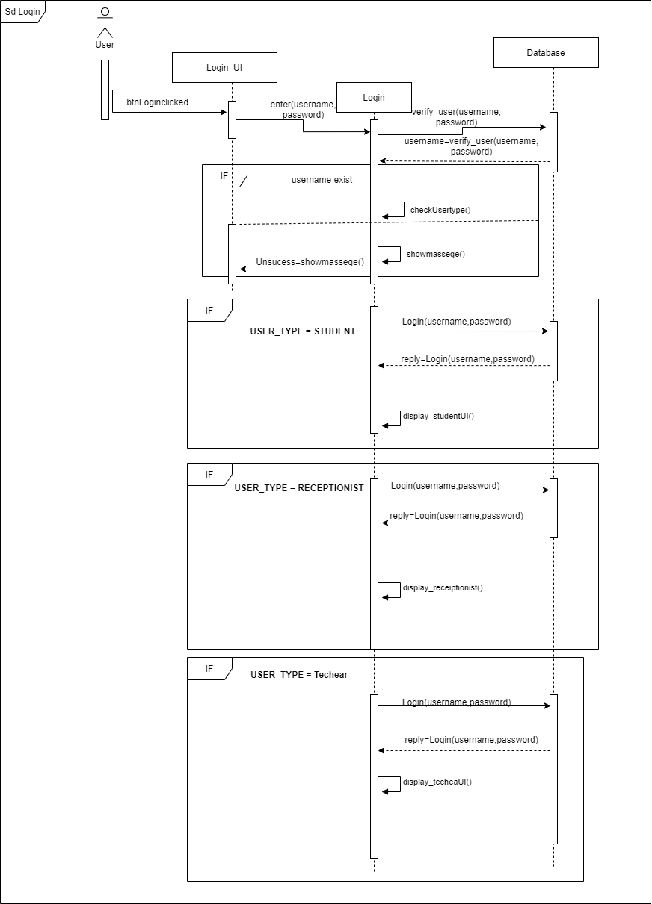
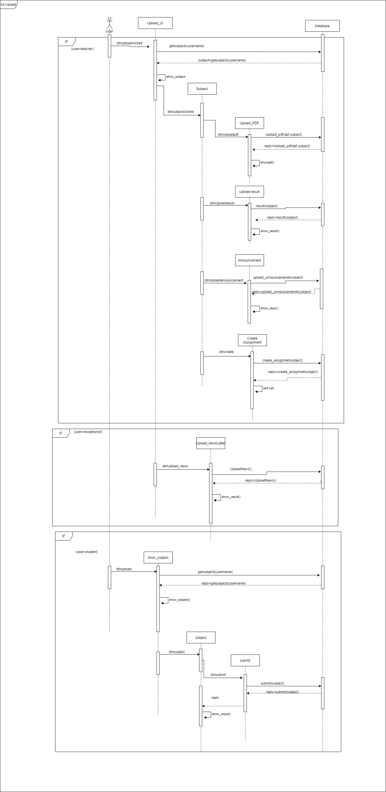

# Interaction Sequence Diagrams

```
This section models the interaction sequences between classes in the system
```
### Monitoring System


### Registration System


### Settings System


### Login System


### Upload System

