# Comprehensive verification and validation plan

### Validation

To validate our software requirements for MonitUs system we will apply these 4 methods which include:
  *	Inspection
  * Demonstration
  * Test
  *	Analysis

We will start of by first inspecting our system, we know that we created a system that will effectively facilitate communication between teachers and students which will then lead to a much better management of workflow between the students completing a assignment and teachers giving the feedback on the students assignment. Inspection will be done by reading our hard code  ensure and examine that we do have the buttons needed to execute and initiate required functionality like for the students submitting and downloading their assignments, for the teachers to upload the assignments for the students and also for teachers to then give feedback on the assignments completed by the students.

Secondly we will do a demonstration of our MonitUS system which will be a showcase of how MonitUs is intended to be used for validation of the results as expected. How this will go about will be that from the different point of views:
* Teachers:

we know and are expecting that they will input their login details and have a different screen from the students and receptionist. The teacher will be able to see where she/he can upload the assignments for the week for a specific subject and grade, they will also be able to see which students have uploaded their marks and so forth. The teacher is also then expected to be able to see and then give feedback on the assignments completed  by his/her students. This demonstrates also that the teacher is monitoring and seeing what the students are writing and if they do understand the work.

* Students:

When the students input their login details they see a screen where they can access and download their assignments for the week , they can see their marks and also  where  they can upload their completed work. Once the students have submitted they will then get feedback from teachers on they completed works where the teacher will either tell them they understand the work or if they need to focus more on a specific area. This demonstrates the monitoring of progress.

Thirdly we will test our system by using a set of predefined series of inputs and or data to verify and ensure that our system(MonitUs) shall produce a predefined outputs as specified by the requirements. So when a teacher enters his/her login details we know and expect MonitUs to show her a screen where she uploads her/his class students assignments for a specific subject and grade, a screen where she/he can see which student has uploaded. The teacher will also be able to see the students progress in graph form and also be able to submit feedback to the students completed assignments. For the students we know and expect when their input their login details to see a screen which shows them where they can access their assignments, a screen where they can upload their completed assignments and also view their own progress. The students can then also see feedback from the teacher on their completed assignments to understand where they going wrong or if they are doing the right thing.

Finaly we will analyse our system this will be done by using testing tools such as test cases. This will allow us to make predictive statements about the typical performance of MonitUs system based on confirmed test results or by combining the outcome of individual test cases to perhaps conclude something new about MonitUs. The analysis method is used often to find or predict the breaking point of a system. So with MonitUs we will then analyse the relationship between the work progress of the class and the feedback from the teachers. So we will take inconsideration the completed assignments of the students, the teacher will give feedback on every students completed assignment for example  Maths, she/he will take not of the overall understanding of the class of the subject. Once she has seen where mostly the students are struggling at, in her next assignment she will focus more on that issue and explain more so that the class as a whole can have positive progress and do better. This analysis will then show the effectiveness of MonitUs cause the teacher understands where the students are struggling and she can address it directly.

### Verification

#### Test Cases

##### Login Positive and Negative Test Cases

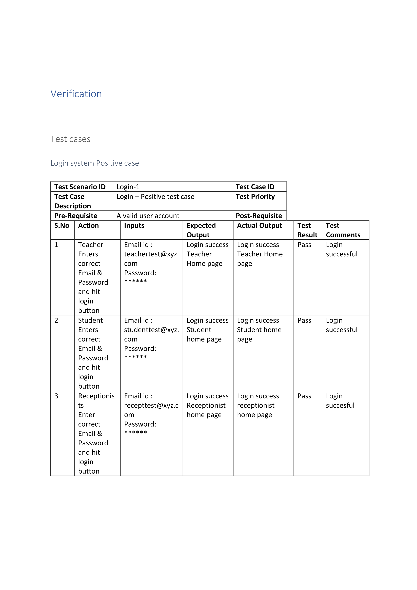
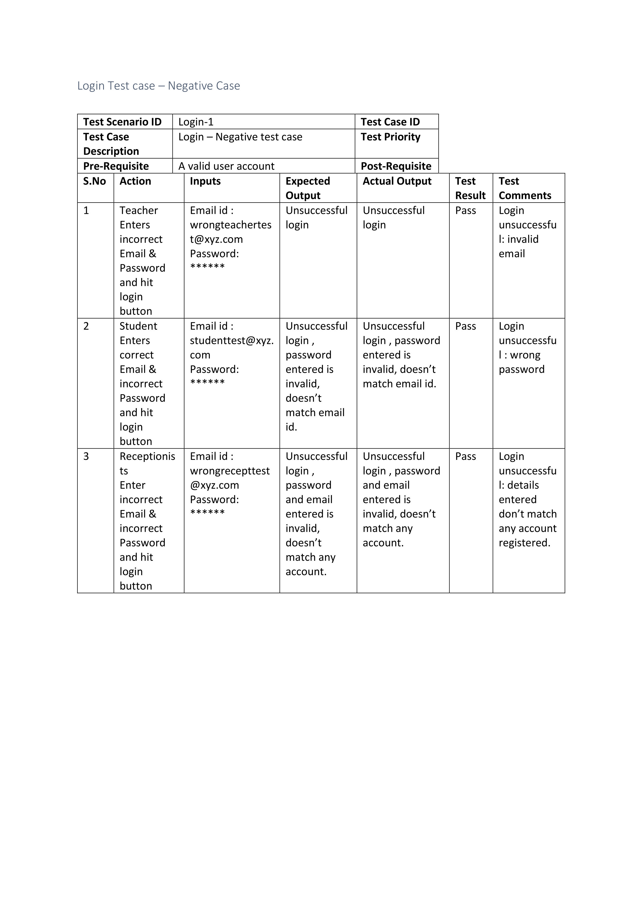

##### Upload Positive and Negative Test Cases

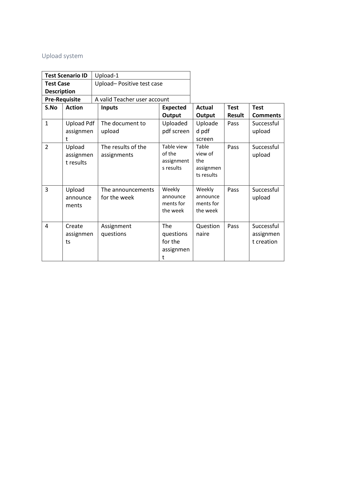
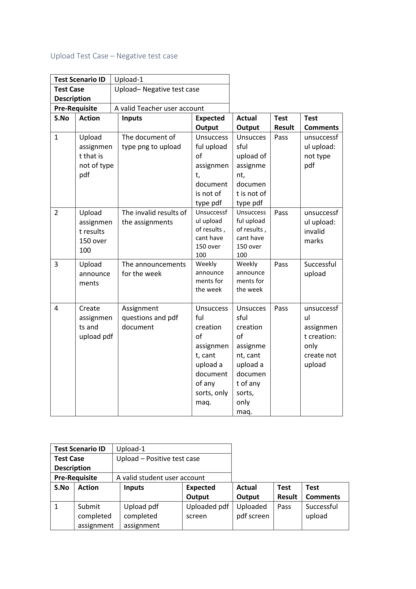
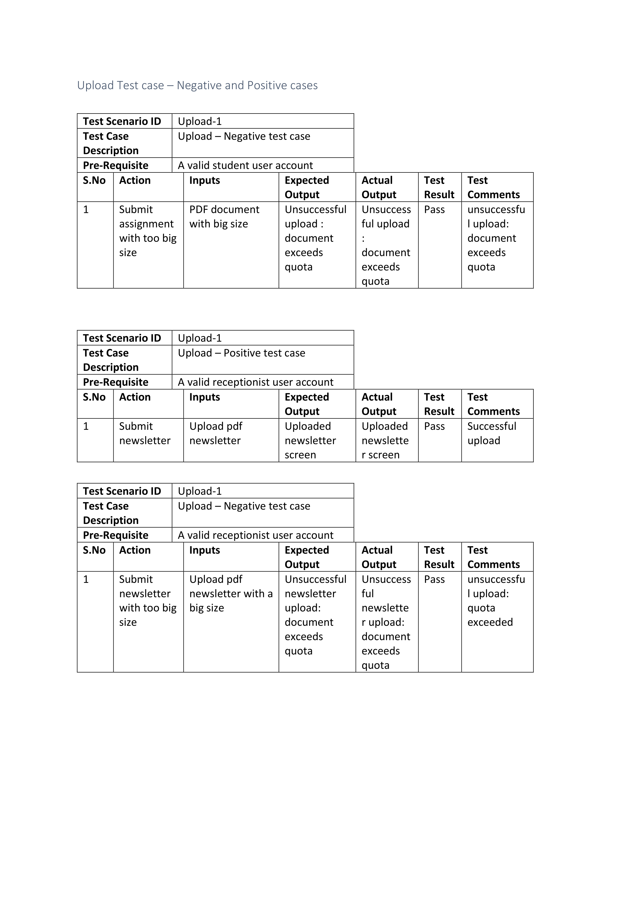

##### Monitor Positive and Negative Test Cases

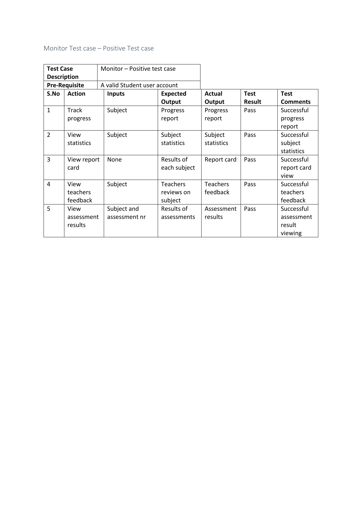
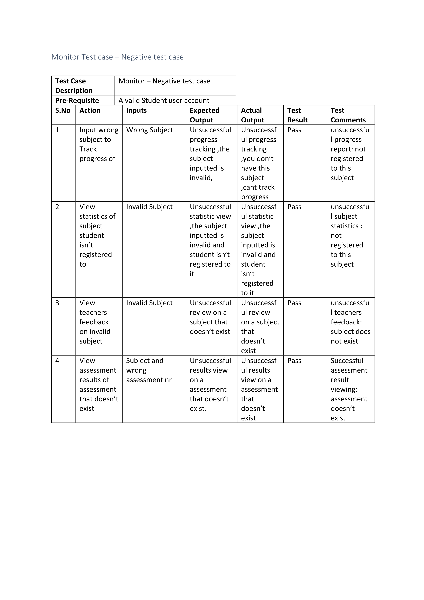
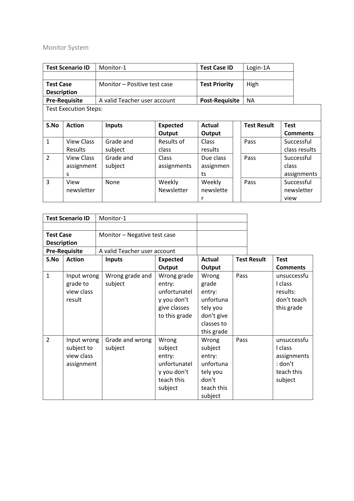

##### Setting Positive and Negative Test Cases

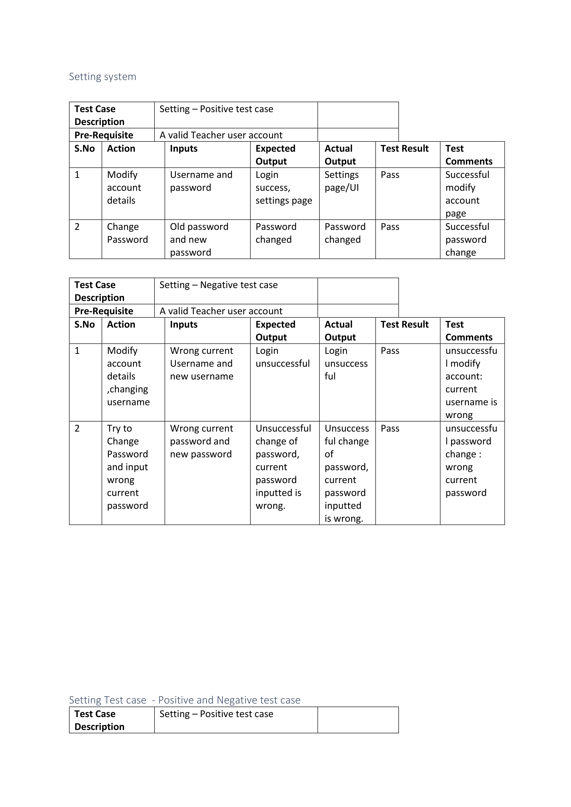
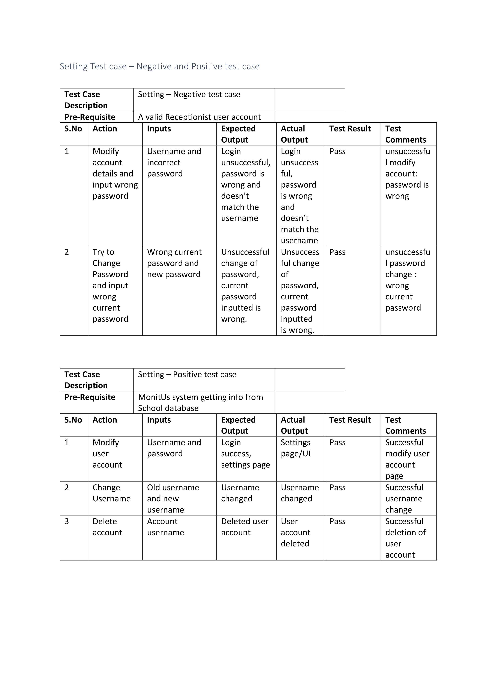
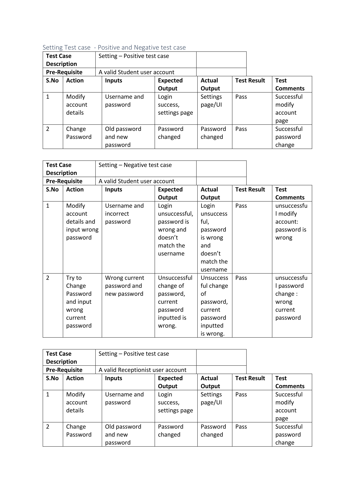

##### Registration Positive Test Case

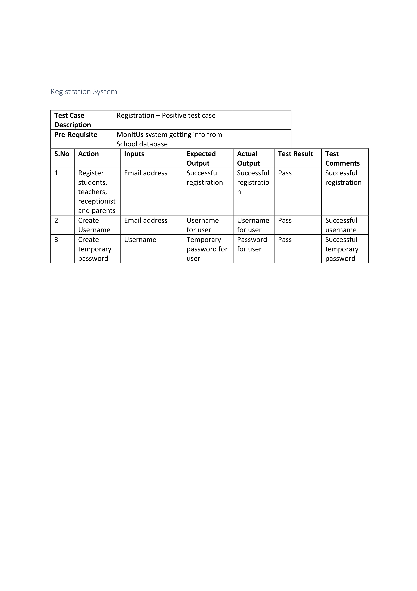

