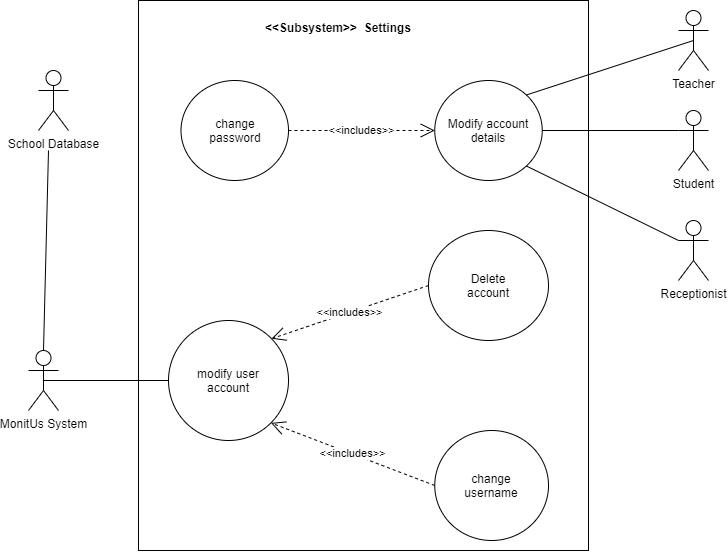
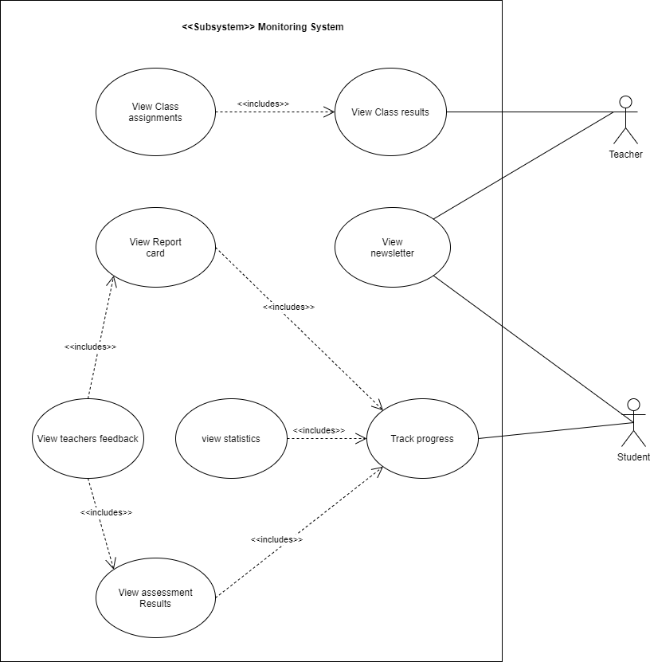
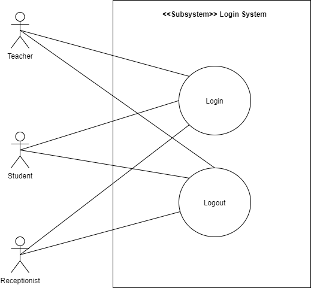
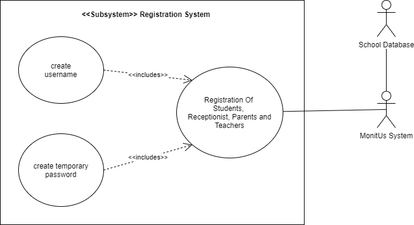
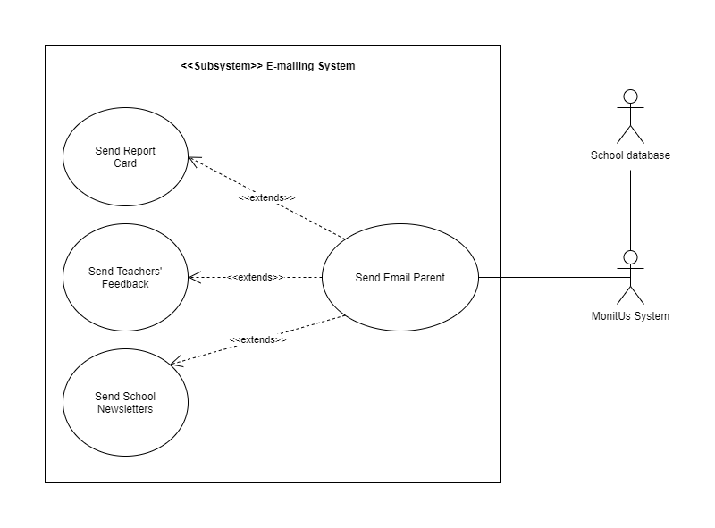
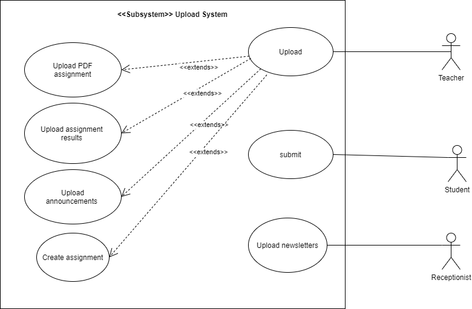

# Use Cases

## Updated Sub Systems
```
The following are the use cases of the subsystems
```
### Settings System


### Monitor System


### Login System


### Registration System


### Emailing System


### Upload System


